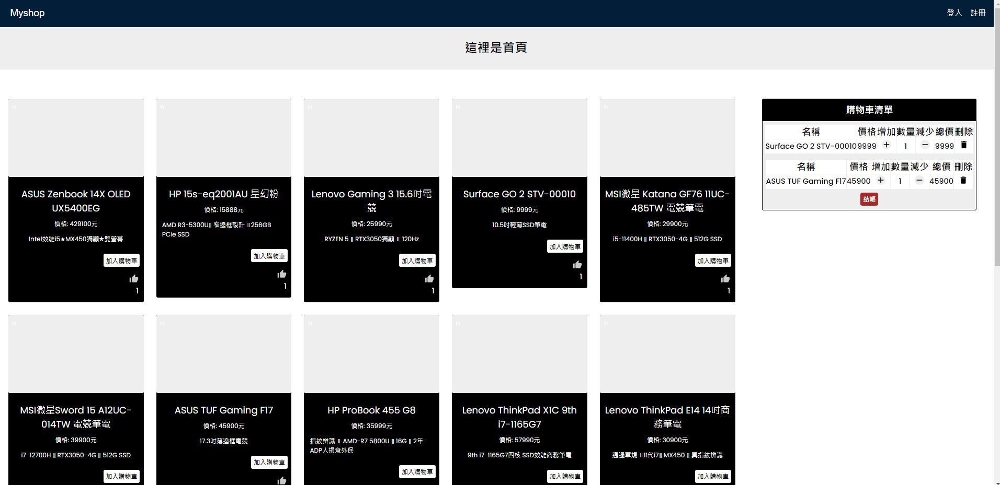
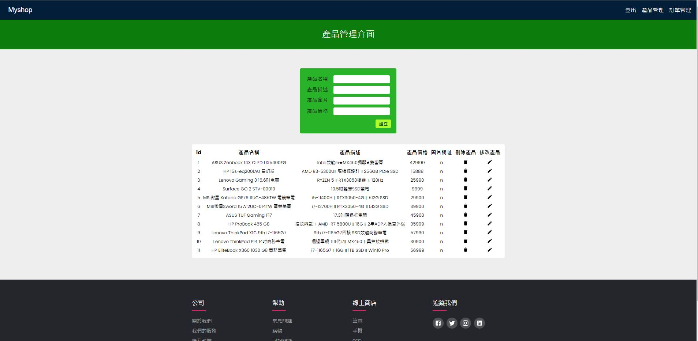

# `Myshop 購物商店實作`

點這裡看功能實作成果 [youtube 連結](https://www.youtube.com/watch?v=6GbURniZVtc)

本專案目的為透過實作商務網站來達到學習目的，裡面包含:

1. 使用 google oAuth 和 JWT 實作登入跟註冊
2. 使用 session storage 實作與儲存購物車清單
3. 使用 stripe 與金流服務進行串接，可以測試信用卡付款功能
4. 產品管理頁面 crud 實作練習，可新增修改刪除產品內容
5. 產品點讚功能 個別用戶可以對喜歡的商品進行點讚
6. 個人頁面 裡面紀錄訂單歷史和個人資訊，用戶可以修改自己的密碼

## `Demo`

點擊可至我部署的連結查看該網站功能:[點我](https://elegant-meninsky-da2112.netlify.app/)

## `使用技術`

- 前端: react.js
- 後端: node.js
- 資料庫: mysql、sequelize

### `網站頁面`

- 首頁
  

- 登入頁面
  

- 產品管理
  
